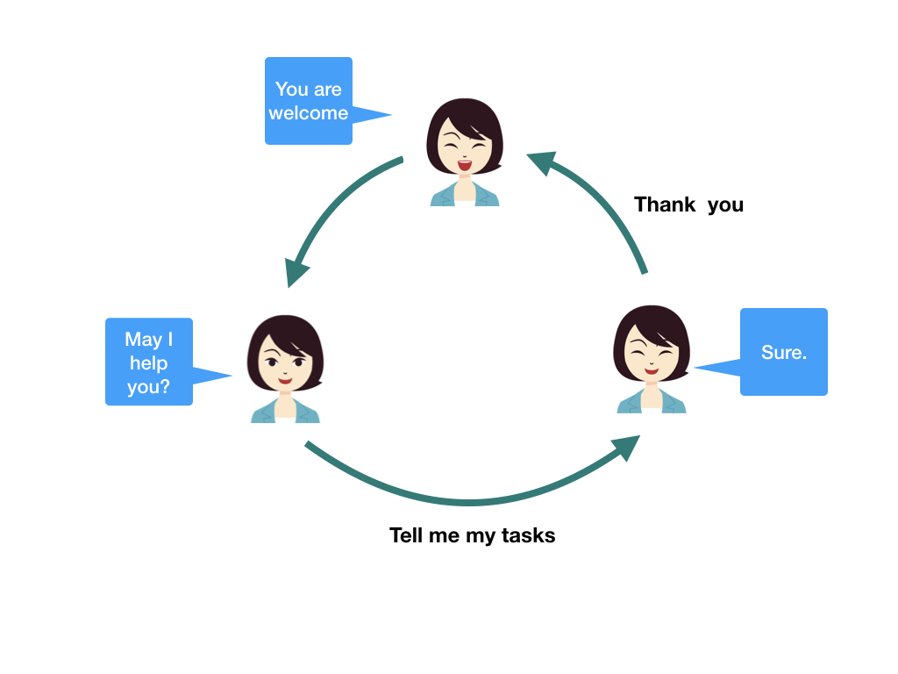
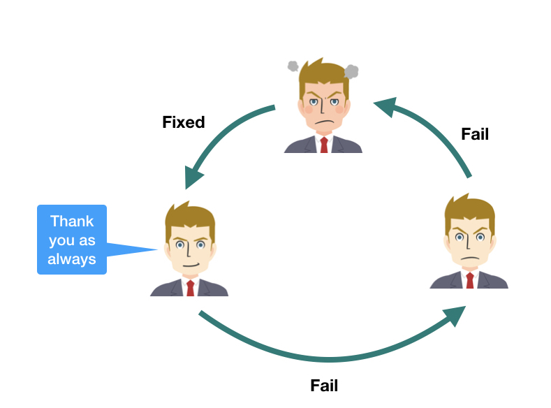

[separator=::]
= Documentation of DialogFirm :: a chat bot platform for Unity
:doctype: book
:source-highlighter: coderay
:listing-caption: Listing
:pdf-page-size: Letter
:author: Takahiko Ito
:title-logo-image:: image::./res/butler.png[width=100, align=right]
:revnumber: 0.8
:revdate: 05-01-2019
:toc: right
:toc-title: Table of Contents
:toclevels: 4
:imagesdir: ./


== Colophon

Version: {revnumber}

Version Date: {revdate}

== Overview

DialogFirm is a simple chat bot engine for the Unity platform. Given input sentences, DialogFirm detects
the intent and then reply the reply sentence. Simple bot provides an Amazon Alexa styled JSON configuration.
In addition, functions for practical applications such as state transitions or slot type matching are provided.

The following image shows the an image of the state transitions. In the image, we can see the state of guide changed
by input sentence from users.



== Basic Usage

DialogFirm has `Simple.BotEngine` which manages the dialogue with the user following
specified configuration file. We can create a `BotEngine` specifying a configuration file.
The following is a sample of creating a `BotEngine` object.

```
void CreateBot()
{
    string settingFilePath = Application.dataPath + "/DialogFirm/Scenes/simple-bot-conf.json";
    string setting = File.ReadAllText(settingFilePath);
    this.bot = new BotEngine(setting);
}
```

This example reads configuration stored in file `Application.dataPath + "/DialogFirm/Scenes/simple-bot-conf.json"` and then load the settings to a string `setting`.
Then it creates the BotEngine object.

NOTE: configuration files of BotEngine are stored as `Streaming Assets`. Details of `Streaming Assets`, please see the https://docs.unity3d.com/2018.3/Documentation/Manual/StreamingAssets.html[manual].


After we create a `BotEngine` instance, the instance is ready to get input sentence.
Adding input sentence (string type),  `BotEngine` returns the reply sentence following the given setting file.

```
public void RespondToInput(string input)
{
    var reply = this.bot.ReplySentence(input);
    text.text = reply;
    inputField.text = "";
}
```

In the following sections, we learn the configurations and practical usage of the DialogFirm framework.

== Configurations

This section starts from the simple DialogFirm configuration. DialogFirm has a JSON
formatted configuration file. The following is a tiny example.

```
{
  "intents": [
    {
      "name": "repeat",
      "match": {
        "type": "verbatim",
        "expressions": [ "repeat", "pardon me?" ]
      }
    }
  ],
  "responders":
  {
    "repeat": [
      {
        "responds": [ "Go straight." ],
      }
    ],
    "default": [{
      "target": "default",
      "responds": [ "Sorry I do not understand what you mean." ]
    }]
  }
}
```

In the above example, we see that the configuration files have two blocks (`intents` and `responders`).
We register `intents` to extract intents from input sentences. `responders` specify the handlers to output
the reply sentences for target intents.

=== Intent settings

`Intents` blocks consist of a list of intent settings. A set of intents make the `BotEngine`
to identify the intents of input sentences. Each element of intent has three properties,
`name`, `match` and `effects`. The following table shows the description of each property.

[cols="1,2", options="header"]
.elements of match block
|===
|Name
|Description

|name
|Name of the intent

|match
|Describe matching patterns. If the type is `verbatim`, we specify substring、If `template`, we add list of template patterns

|effects (optional)
|Describe effects of matching the intent from the users. This block contains the list of effects when the indent is detected.
|===

==== Intent example

The following is a plain setting to identify if the user input is about weather.

```
"intents": [
    {
      "name": "weather",
      "match": {
        "type": "verbatim",
        "expressions": [ "forcast", "weather" ]
      }
    }
]
```

As we see intents block is a list and contains one intent block. The intent block has three elements `name`, `match`.
In the `match` block, we specify the matching expressions. `match` has two types of matching type. We specify matching
type in `type` element. DialogFirm provides two types of matching. `verbatim` and `template`. Next section shows the
types of intent matching.

==== Verbatim matching

`verbatim` provides the plain matching, with which intent is match when the registered expression is contained in
the input sentence. In the `verbatim` match we specify intent by matching with registered expressions.
The following is the example shown in the previous section.

```
"intents": [
    {
      "name": "weather",
      "match": {
        "type": "verbatim",
        "expressions": [ "forcast", "weather" ]
      }
    }
]

```

NOTE: elements of expressions are automatically normalized into lowercase

With the `expressions` settings, DialogFirm can tell if the input is about weather when input
contains registered expressions `forcast` or `weather`.

==== Template matching

Compared with `verbatim`, `template` type matching provides more powerful matching with `slots` and `types`.
The following settings contains one intent setting whose type is `template` and contains a `slots` block.

```
intents: [
        {
            "name": "weather-forcast",
            "match" : {
                "type" : "template",
                 "slots" : [{
                     "name" : "targetLocation",
                      "type" :  "locations"
                  } ]
                "patterns" : [ "weather forecast for #{targetLocation}?" ]
            }
        },
],
"types" :
[
   {
       "name" : "locations",
       "examples", ["Paris", "New York", "Tokyo"]
    }
]
```

NOTE: symbols such as hyphen or underbar cannot be used in type and slot names

NOTE: elements of examples are automatically normalized into lowercase

The next section describe how we can make template intent using `types` and `slots`.

=== Slots and Types

In the slots block, we specify a `type` in `types` block. `types`
block contains a list of types which contains a list of `examples`.
`example` contains a list of expressions, which are used in the
`slot` block in `template` type of intents to detect intent.

In the above configuration example, the type `location` is used in `slot`
named `target-location`.

The patterns of template type of intents can embed the slots. the pattern
matches the inputs which are expanded patterns such as `weather forecast for Paris`
or `weather forecast for New York`.

TIP: The matched slot key and value are used in the condition block of the responder. For details please see Section <<Effect>>.

=== Responder settings

`responders` is a list section in the configuration file, we add the responder
settings for the each target intent defined in `intents` block.

The following configuration, one intent `repeat` is defined in `intents` block.
The `responders` section has two block, for `repeat` and `default` targets. `repeat` target is applied when
the `BotEngine` detect the intent of inputs as `repeat`. `default` target is a special target, which is called when no intent is detected.

NOTE: When configuration file does not `default` intent, BotEngine.replySentence throws System.InvalidOperationException.

```
{
  "intents": [
    {
      "name": "repeat",
      "match": {
        "type": "verbatim",
        "expressions": [ "repeat", "pardon me?" ]
      }
    }
  ],
  "responders":
  {
    "repeat": [
      {
        "responds": [ "Go straight." ],
      }
    ],
    "default": [{
      "responds": [ "Sorry I do not understand what you mean." ]
    }]
  }
}
```

Each respond block contains `responds` element which has a list of respond sentences.
`BotEngine` select randomly the respond sentence from the list.

=== Handling State

DialogFirm support state of dialogue. We can add the settings of state,
combining `effects` and `condition` blocks.

==== Effect

BotEngine provide two ways to setting `state`. One is effect described in this section, the other is `template matching`.

NOTE: The slot name and the value in template matching is automatically set to state.

Each intent of `intents` block supports `effects` block, where we can define the effect of state, when the BotEngine identifies
the intent. `effects` has the following elements.

[cols="1,2", options="header"]
.types of effect
|===
|Name
|Description

|field
|property name
|type
|Specify type of the effect (`incr`, `decr`, or `set`)
|defaul
|Set the default value of the property
|===


```
"intents": [
    {
      "name": "whether",
      "match": {
        "type": "verbatim",
        "expressions": [ "forcast", "weather" ]
      },
      "effects" : [{
			    "field": "anger-level",
    			"type": "incr",
          "default": 0
		    }]
    }
]
```

In the above example, every time identifying the whether intent, the `angry-level` increased.
DialogFirm support the following types of effect.

[cols="1,2", options="header"]
.types of effect
|===
|Name
|Description

|incr
|Increments the value of specified property (NOTE: the type of the property must be integer)

|decr
|Decrements the value of specified property (NOTE: the type of the property must be integer)

|set
|Set the value of specified property (NOTE: the type of the property must be string)

|copy-ifield
|Copy the int value of specified property field (NOTE: the type of the target property field value must be int)

|copy-sfield
|Copy the string value of specified property field (NOTE: the type of the target property field value must be string)
|===

The states such as are used when the BotEngine select the responder using `condition`. In the next section,
we will learn the `responder` settings including usage of `condition`.

==== Condition

The state defined in `effects` can be used in matching `responder`.
The following example make use of state with `effect` and `condition`.

The effects of `location` block defined `failed-num` is incremented from 0 when the
`location` intent is identified. Then a respond block in the `location` block in
`responders` defines `condition` blocks which defines the condition to apply the responder.
For responders with `condition` block does not applied even when the intent is the target
one, if the state does not meet the condition.


```
{
  "intents": [
      {
        "name": "location",
        "match": {
          "type": "verbatim",
          "expressions": [ "location", "office", "where" ]
        },
        "effects" : [{
  			    "field": "failed-num",
      			"type": "incr",
            "default": 0
  		    }]
      }
  ],
  "responders":
  {
    "location": [
      {
        "responds": [ "The conference is held in 321 room of O-nine building." ],
        "condition": {
          "must": [
            {
              "range": { "failed-num" : { "lte": 1 }}
            }
          ]
        }
      },
      {
        "responds": [ "Please call to the a responsible person, the number is +81-90-0004-49009." ],
        "condition": {
            "range": { "failed-num" : { "gte": 2 }}
        }
      }
    ],
    "default": [{
      "target": "default",
      "responds": [ "Sorry I do not understand what you mean." ]
    }]
  }
}
```

For `location` intent in the above setting, the configuration file contains
two responders both of them have `condition` block which
defines `range` condition. If the `failed-num` is less then or equals `1` first
respond is applied otherwise the second one is applied.

DialogFirm supports two types of conditions (`range` and `term`).

[cols="1,2", options="header"]
.types of conditions
|===
|Name
|Description
|range
|Condition on range of values (`integer`).
|term
|Condition on value existence of specified property name.
|===

The following table shows the supported types of range conditions.

[cols="1,2", options="header"]
.types of range condition
|===
|Name
|Description
|gte
|Greater-than or equal to
|lte
|Less-than or equal to
|eq
|Equal to
|===

`condition` is useful for controlling the discourse between DialogFirm and users, but it
is still inadequate to express complex condition. DialogFirm supports `boolean condition` to
express complex conditions.

==== Boolean conditions

`DialogFirm` supports the combinations of conditions with boolean conditions (`should` and `must`).
The following table shows the descriptions of supported boolean conditions.

[cols="1,2", options="header"]
.types of boolean condition
|===
|Name
|Description
|should
|One of the sub-conditions must be satisfied
|must
|All sub-conditions must be satisfied
|===

Using boolean conditions, we can express more complicated conditions. In the following setting,
a respond sentence with condition ``"Oh my god... Project looks chaos ..."`` is responded
when one of the conditions in the `should` block which have two child conditions.

```
"responders" : {
  "fail": [
    {
      "list": [
        "Oh my god... Project looks chaos ..."
      ],
      "condition" : {
        "should" : [
          {
            "range": { "failed-num": { "gte": 3}},
            "term": { "contain-critical-error": "true"}},
          }
        ]
      }
    },
    {
      "list": [
        "Please fix the build failure"
      ]
    }
  ],
  "default": [{
    "type": "random",
    "name": "default",
    "list": [
      "Build looks nice :-)"
    ]
  }]
}
```

== Class and APIs

This section describes the public classes and the usage provided by DialogFirm package.
Basically we only use few objects in `DialogFirm` package.

=== BotEngine

`BotEngine` has the main role in the DialogFirm package. This object accepts input sentence and returns reply sentences.

==== Constructor

The constructor of `BotEngine` takes a string parameter which contains the configuration of DialogFirm.

The following is a sample to create a BotEngine instance.

```
BotEngine LoadConfig()
{
    string settingFilePath = this.GetStreamingAssetsPath("DialogFirm/Guide/guide-conf.json");
    string settingString = File.ReadAllText(settingFilePath);
    return new BotEngine(settingString);
}
```

In the above example, the configuration is stored as a Streaming Assets file.
The method loads the file and pass the string content to the constructor of BotEngine.

==== ReplySentence

`ReplySentence` returns the sentence for input sentences following the specified configuration file.
Note that `ReplySentence` throws `InvalidOperationException` when the input sentence does not match
any defined intent and the `default` intent does not registered in the configuration files.

ca
The following function, `Reply` loads the input
from inputField (InputField) and then gets the reply sentence by bot (`BotEngine` object) putting the input sentence.

```
public void Reply()
{
    var reply = this.bot.ReplySentence(inputField.text);
    text.text = reply;
}
```

==== State

`BotEngine` has a method to return the `State` object which contains the status of `BotEngine`.
The following sample calls the `State` method to switch the images of an application.

```
public void Reply()
{
    var reply = this.bot.ReplySentence(inputField.text);
    this.ChangeImage(bot.State.GetInt("fail-count"));
    text.text = reply;
}

void ChangeImage(int failCount)
{
  if (failCount == 0)
  {
    guideImage.sprite = happySprite;
  }
  else if (failCount == 1)
  {
    guideImage.sprite = defaultSprite;
  }
  else
  {
    guideImage.sprite = confusedSprite;
  }
}
```

In the next section, we go through the usage of `State` object.

=== State

`State` objects returned from `BotEngine.State` method have several methods to access the status of `BotEngine`.

[cols="1,2,3", options="header"]
.methods of State object
|===
|Name
|Parameters
|Description

|HasKey
|key (string)
|Return True when the state attribute (key) is defined. Otherwise returns False

| SetInt
| key (string), value (int)
| Set the value to specified attribute name

| SetString
| key (string), value (string)
| Set the value to specified attribute name

| GetInt
| key (string)
| Get the value of specified attribute. If the value does not exist, throws `InvalidOperationException`

| GetString
| key (string)
| Get the value to specified attribute. If the value does not exist, throws `InvalidOperationException`

| DeleteAll
| None
| Delete all the attributes
|===

Using set methods of State, we can set the status of BotEngine or users in your application file as follows.

```
public void SetUserName(String name)
{
    this.engine.state.SetString("user-name", name);
}
```

== Samples

In this section, we go through sample configurations of DialogFirm though two chat bot examples.
Both examples are bundled in this DialogFirm package as scenes.

=== Guide

In this section, we see a tiny chat bot example, `Guide` which supports the audiences of a small conference.
As the first function of this bot application. We add the configuration to tell the users the misc information of the conference.

This conference uses two rooms (134 and 445) in a building. The following is the first setting of this application.

```
{
  "intents": [
    {
      "name": "room-schedule",
      "match": {
        "type": "template",
        "slots": [
          {
            "name": "roomId",
            "type": "roomIds"
          }
        ],
        "expressions": [ "schedule of the room ${roomId}", "schedule of room ${roomId}", "schedule of ${roomId}" ]
      }
    }
  ],
  "types": [
    {
      "name": "roomIds",
      "values": [ "134", "445" ]
    }
  ],
  "responders":
  {
    "room-schedule": [
      {
	       "responds": [ "Room 134 has two sessions. One is on Jupyter Notebook from 12:00 and the other is on machine learning from 14:00" ],
	        "condition": {
	           "term": { "roomId" : "134"}
	        }
      },
      {
	        "responds": [ "Room 445 has one session. Session on Docker is held from 15:00" ],
	        "condition": {
	           "term": { "roomId" : "445"}
         	}
      },
      {
	       "responds": [ "There is no session at the room." ],
      }
    ],
    "default": [{
      "target": "default",
      "responds": [ "Sorry I do not understand what you mean." ]
    }]
  }
}
```

In the above settings, DialogFirm returns the schedule of the room which is specified by the users.
There is one intent (`room-schedule`) which is a `template` matching using slot named `roomIds`.
This template matches `tell me the schedule of room`. In responders section, two responders
(`room-schedule` and `default`) are registered. `room-schedule` is applied when the inputs from users
match `room-schedule` intent, otherwise `default` responder is applied.

`room-schedule` responder have three blocks. Which of them are used as the respond is depends on the `condition`.
When the a user asks for the schedule of room `134`, the first block is applied. When any conditions are not matched,
the last block (`There is no session at the room.`) is applied.

For example, when a user submit a sentence **Tell me the schedule of the room 134**, the bot
replies a sentence **Room 134 has two sessions. One is on Jupyter Notebook from 12:00 and the other is on machine learning from 14:00**.

In the bundled Scence `Guide`, the setting file handles the question on the location and topics of the sessions,
please see the details of the configuration file.

=== Release Manager

Next example is `Release Manager` who is manager of a software product and checks the release messages.
When the release messages does not contains errors, he is satisfied, but when there are errors, he get nervous.
The following image show the state transition of the manager. His state is changed when he got messages from the users.



The following setting contains two intents `failed` and `succeeded`. They match keywords `fail` and `fix` respectively.

```
{
  "intents": [
    {
      "name": "fail",
      "match": {
        "type": "verbatim",
        "expressions": [ "fail", "exception", "error" ]
      },
      "effects": [
        {
          "field": "anger-level",
          "type": "incr",
          "default": 0
        }]
    },
    {
      "name": "succeeded",
      "match": {
        "type": "verbatim",
        "expressions": [ "fix", "succeed" ]
      },
      "effects": [
          {
            "field": "anger-level",
            "type": "set",
            "value": 0
          }
      ]
    }
  ],
  "responders" : {
    "fail": [
      {
        "responds": [ "You need to fix the problem as soon as possible!" ],
        "condition" : {
          "must" : [
            {
              "range": {"anger-level": { "gte": 3}}
            }
          ]
        }
      },
      {
        "responds": [ "Can anyone fix the build failure?" ]
      }
    ],
    "succeeded": [
      {
        "responds": ["You did a great work as always."]
      }
    ],
    "default": [{
      "responds": [ "I do not know the details but looks nice :-)", "Looks nice?" ]
    }]
  }
}
```

A feature of the above setting is `effects` in the `intents` block. When the bot gets
inputs which match `failed` intent, state `anger-level` incremented.

The state `anger-level` is used in a responder section. When anger level is greater than equals to `3`,
the bot responds with first block of responds, otherwise the bot reply "Can anyone fix the build failure?".
When the bot get the input matches the `succeeded` intent, the `anger-level` is set to `0`.

## Summary

This article describes how to make settings of DialogFirm. As we see, we can make complicated application
using `condition` and `effect` features.

If you have any questions or feature request, please let us know through forum of Unity Assets markets.
