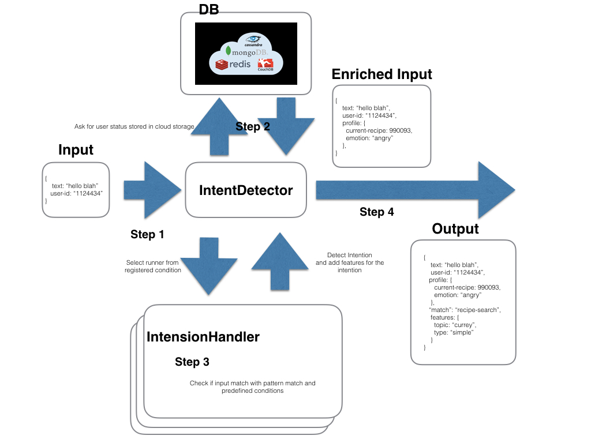

= Satori Documentation
:doctype: book
:source-highlighter: coderay
:listing-caption: Listing
:pdf-page-size: Letter
:toc: right
:toc-title: Table of Contents
:toclevels: 4
:imagesdir: ./

== Overview

Satori is automatic intent detector. Given input sentences, Satori detects the intent and arguments needed to generate the reply.

== Function

Satori extracts user's intent and the features needed to generate reply sentence.
For example, given input "Tell me the weather forecast for Redmond.", Satori detect the intent, "weather forcast",
and features "Redmond (location)"

For example, give the following input sentence,

```
{ "text": "Tell me the weather forecast for Redmond." }
```

Satori extracts, the following JSON block.


```
{ "text": "Tell me the weather forecast for Redmond.", "match" : "weather-forcast", "feature" : { "location" : "Redmond" } }
```

Here, "location" in "match" block shows the extracted intent.

Top object of Satori, **IntentDetector** generates outputs containing detected intents.
The following image shows the flow getting input sentence to generating intents.



As we see from the above image, `IntentDetector` processes several steps before output intents.

- Step 1. Get input
- Step 2. Access DB table to get the user status information adding `profile` block
- Step 3. `IntentDetector` contains multiple `IntentHandler` object and select IntentHandler which matches input sentence. IntentHander add information used to generate the reply sentence in `feature` block
- Step 4. Return JSON object

== Install

To install Satori, we run the following command.

```
npm install satori-flow
```

== Usage

Now we can use classes provided by the Satori package.
Among the classes provided by Satori, the most important class is IntentDetector.
We construct dialogue process using this class.

For example, `IntentDetector` can generate the reply with the following code.

```
    reply(input) {
        const output = this.detector.match(input);
        if (output["match"] in this.runners) {
            return this.runners[output["match"]].reply(output);
        } else {
            return this.runners["default"].reply(output);
        }
    }
```

The above code is `DialogueManager` a sample of dialogue manager which is bundled in Satori package.
Note that `this.detector` is an instance of the `IntentDetector` class. We can see that `IntentDetector#match` detects
the intent of input sentence and returns the `output`. `DialogueManager` returned reply following the `output` variable
which contains the information to generate the reply.


== Configuration

Satori has a JSON format confiuration file. The following is a sample.

```
{
    intents: [
        {
            "name": "repeat",
            "match" : {
                "type" : "verbatim",
                "patterns" : [ "repeat", "pardon me?" ],
                "condition" : {"current-recipe" : "not null"}
            }
        },
        {
            "name": "recipe-search-with-ingredients",
            "match" : {
                "type" : "whether-forecast",
                "patterns" : [ "Tell me the weather forecast for #{location}?" ]
            }
        },
    ],
    slots: { location: [ 'Redmond', 'Tokyo' ] }
}
```

Configuration files have two blocks (`intent` and `slots`).
`intents` specify the handlers to extract intent from input sentences. `slots` specify variables used  in handlers.

`intents` blocks have list of `IntentHandler`.
`IntentHandler` has two element `name` and `match`.
`name` is the name of an intent. In `match` we specify matching conditions.
`match` have two types of matching pattern `verbatim` and `template`. The following is a description of elements in `match` element.

[cols="1,2", options="header"]
.elements of match block
|===
|Name
|Description

|type
|Select matching type (`verbatim` or`template`). The types means `VerbatimMatcher` and `TemplateMatcher` respectively.

|patterns
|Describe matching patterns. If the type is `verbatim`, we specify substring、If `template`, we add list of template patterns.

|condition (optional)
|Describe conditions which is not in input text. Specifically we add conditions on `context` blocks in input JSON.
|===

The following sections shows the detailed description on the two types of matchers (`VerbatimMatcher` and `TemplateMatcher`).

=== VerbatimMatcher

`VerbatimMatcher` checks if input sentence (`text` element in input JSON) contains listed substring.
For example, we add the following hander in `intents`.

```
{
    "name": "repeat",
    "match" : {
        "type" : "verbatim",
        "patterns" : [ "repeat", "tell me again" ]
    }
}
```

When `IntentDetector` gets the following input,

```
{
    "text" : "I would like to repeat again.",
    "userId" : 985499
}
```

this handler matches the input and `IntentDetector` returns the following JSON.


```
{
    "text" : "I would like to repeat again.",
    "userId" : 985499,
    "match" : "repeat"
}
```

We can see that the returned JSON contains `match` block, in which `value` element is the name of handler (repeat).


=== TemplateMatcher

`TemplateMatcher` check if input sentence (`text` element of input JSON）matches a pattern in listed template.
For example we add the following handler in `intents` block of configuration file.


```
{
    intents: [
        {
            name: 'search-with-ingredient-and-style',
            match: {
                "type" : "template",
                "patterns" : [ "please give me recipes on #{ingredients} with #{style}" ]}
            }
        },
        ...
    ],
    slots:
       {
           ingredients: [ 'potato', 'eggplant' ],
           style: [ 'japanese', 'french' ]
       },
}
```

The above setting contains one template pattern (`please give me recipes on #{ingredients} with #{style}`), which contains two slots (`ingredients` and `style`).

With the configuration, `IntentDetector` gets the following input,


```
 {"text" : "please give me recipes on potato with french"}
```

`IntentDetector` returns the following JSON.

```
{
    'text' : 'please give me recipes on potato with french',
    'match' : 'search-with-ingredient-and-style',
    'feature' : {
        'ingredients' : 'potato',
        'style' : 'french'
    }
}
```

We can see that `match` block contains handler name, `search-with-ingredient-and-style`.
In addition, `feature` block contains pairs of slot names and value. Elements in `feature` are useful to generate reply sentence.

=== Condition

We specify conditions not dependent on input sentences in `condition` block.
For example, we consider the behavior of `IntentDetector` with the following configuration.


```
{
    "name": "repeat",
    "match" : {
        "type" : "verbatim",
        "patterns" : [ "repeat", "tell me again" ],
        "condition" : {"current-recipe" : "not null"}
    }
}
```

==== Case: condition matches

 `IntentDetector` gets the following input,


```
{
    "text" : "I would like to repeat again.",
    "userId" : 985499,
    "profile" : {
        "crrent-recipe" : 438959
    }
}
```
We can see this user read a recipe (`profile` block contains`current-recipe` element).
And therefore `IntentDetector` return the JSON containing the hdndler name.

```
{
    "text" : "I would like to repeat again.",
    "userId" : 985499,
    "match" : "repeat"
}
```


==== Case: condition does not match

With the above setting, `IntentDetector` gets the following input,

```
{
    "text" : "I would like to repeat again.",
    "userId" : 985499
}
```

The handler does not match, since this user do not read a recipe (input JSON does not `current-recipe` element)
even when input sentence matches the condition.
When none of handler does not maches, Intent Detector return JSON objcet in which `match` element set to "nothing".

```
{
    "text" : "I would like to repeat again.",
    "userId" : 985499,
    "match" : "nothing"
}
```

